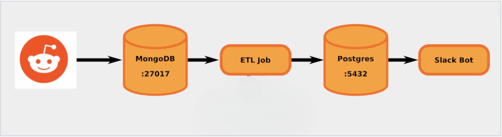

# SlackBot 

The Slack Bot project aims to develop a Python-based bot that integrates with the popular messaging platform Slack and utilizes Reddit's API to enhance collaboration and information sharing within a Slack workspace. The bot will provide various functionalities such as fetching Reddit posts, sharing them in Slack channels, and enabling users to interact with Reddit content directly from Slack.

# Dockerized Reddit Data Pipeline

## Overview
This project implements a **Dockerized Data Pipeline** that collects Reddit posts, analyzes their sentiment, and publishes the most positive or negative posts to Slack every 10 minutes. The pipeline leverages **MongoDB**, **PostgreSQL**, and **Docker Compose** to efficiently process and store data.



## Features
- **Data Collection**: Scrapes Reddit posts and stores them in **MongoDB**.
- **ETL Pipeline**: Extracts, transforms, and loads (ETL) data from **MongoDB** to **PostgreSQL**.
- **Sentiment Analysis**: Uses NLP techniques to analyze sentiment.
- **Slack Bot Integration**: Publishes top positive/negative posts to Slack.
- **Dockerized Deployment**: Runs all services in isolated containers using **Docker Compose**.

---

## Tech Stack
- **Docker & Docker Compose** - Containerized deployment
- **Python** - ETL scripting and sentiment analysis
- **MongoDB** - Initial data storage (NoSQL)
- **PostgreSQL** - Processed data storage (SQL)
- **Slack API** - Bot integration for message publishing

---

## Project Structure
```
📂 SlackBot
│── 📁 etl_job                
│   │── config.py          # Configuration files (API keys, database connections)    
│   │── Dockerfile  
│   │── etl.py       
│   │── log-test.log
│   │── requirements.txt     # Python dependencies
│── 📁 reddit_collector
│   │── config.py 
│   │── Dockerfile
│   │── get_reddits.py
│   │── log-test.log         
│   │── requirements.txt     # Python dependencies
│── 📁 slack
│   │── config.py 
│   │── Dockerfile
│   │── log-test.log         
│   │── requirements.txt     # Python dependencies       
│   │── slackbot.py             
│── README.md                      
```

---

## Installation & Setup
### Prerequisites
Ensure you have the following installed:
- [Docker](https://docs.docker.com/get-docker/)
- [Docker Compose](https://docs.docker.com/compose/install/)
- Python 

### Steps to Run the Project
1. **Build and Start Containers**
   ```sh
   docker-compose up --build
   ```

2. **Check Running Containers**
   ```sh
   docker ps
   ```

3. **Monitor Logs**
   ```sh
   docker-compose logs -f
   ```

---

## Pipeline Breakdown
### 1. **Data Collection**
- Fetches posts from Reddit using the Reddit API.
- Stores raw data in **MongoDB**.

### 2. **ETL (Extract-Transform-Load)**
- Extracts data from **MongoDB**.
- Cleans, processes, and applies **sentiment analysis**.
- Loads transformed data into **PostgreSQL**.

### 3. **Slack Bot**
- Fetches the most positive/negative post.
- Publishes it to a **Slack channel** every 10 minutes.

---

## Challenges & Learning Outcomes
- **Installing and configuring Docker & Docker Compose**.
- **Building a scalable data pipeline with ETL processes**.
- **Working with NoSQL (MongoDB) and SQL (PostgreSQL) databases**.
- **Integrating Slack API for automated messaging**.

---

## License
This project is licensed under the MIT License.

---
